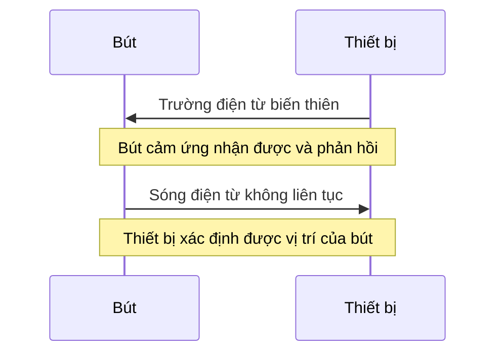
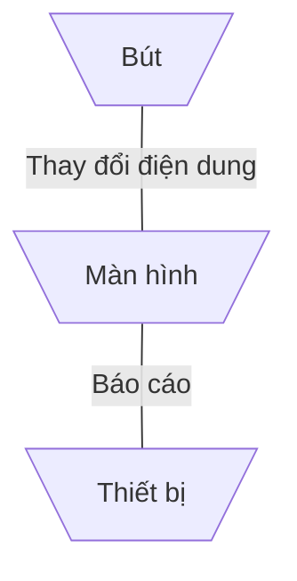

---
# try also 'default' to start simple
theme: apple-basic
# random image from a curated Unsplash collection by Anthony
# like them? see https://unsplash.com/collections/94734566/slidev
image: https://www.eventus.si/en/iimg/7450/i.jpg
# some information about your slides (markdown enabled)
title: Bảng vẽ - bút vẽ
# apply UnoCSS classes to the current slide
layout: intro-image
# https://sli.dev/features/drawing
drawings:
  persist: false
# slide transition: https://sli.dev/guide/animations.html#slide-transitions
transition: slide-left
# enable MDC Syntax: https://sli.dev/features/mdc
mdc: true
# duration of the presentation
preload: true
---

  
    25127542 - Đàm Anh Tuấn
  

  <h1>Bảng vẽ - bút vẽ</h1>
  
Công cụ đắc lực của họa sĩ kĩ thuật số

  

  Nhấn Space để di chuyển đến trang tiếp theo. <carbon:arrow-right />
  

<!--
The last comment block of each slide will be treated as slide notes. It will be visible and editable in Presenter Mode along with the slide. [Read more in the docs](https://sli.dev/guide/syntax.html#notes)
-->

---
transition: slide-up
level: 2
---

# Di chuyển
## Phím tắt
|                                                     |                             |
| --------------------------------------------------- | --------------------------- |
| <kbd>right</kbd> / <kbd>space</kbd>                 | hoạt động hoặc slide tiếp theo     |
| <kbd>left</kbd>  / <kbd>shift</kbd><kbd>space</kbd> | hoạt động hoặc slide trước |
| <kbd>up</kbd>                                       | slide trước              |
| <kbd>down</kbd>                                     | slide tiếp theo                  |
| <kbd>enter</kbd>                                    | tự động chạy                |
| <kbd>esc</kbd>                                      | tắt tự động chạy            |
| <kbd>`</kbd>                                        | outline view                   |
<!-- https://sli.dev/guide/animations.html#click-animation -->

---
layout: two-cols
layoutClass: gap-16
---

# Mục lục

::right::

<Toc />

---
transiton: fade
layout: fact
---

# Khái niệm
Bảng vẽ kỹ thuật số là một thiết bị đầu vào cho phép người dùng vẽ tay, hình ảnh động và đồ họa, với một thiết bị vẽ giống như bút gọi là bút vẽ, tương tự như cách một người vẽ hình ảnh bằng bút chì và giấy. [nguồn](https://www.webopedia.com/definitions/digitizing-tablet/)

---
image:
---

# Đặc điểm

## Bảng vẽ

Bảng vẽ kỹ thuật có thể là một trong ba loại sau đây, mỗi loại mang theo những đặc điểm riêng biệt cuả nó [nguồn](https://www.xp-pen.com/blog/types-of-drawing-tablets.html)

<v-clicks>

  

    

    

      Bảng vẽ đơn giản
    

  

  

    

      

        
Tấm vẽ đơn giản

        
Phải kết nối vào máy tính để sử dụng với bút

      

      

        
Đòi hỏi kỹ năng

        
Người dùng vừa pahỉ nhìn màn hình máy tính vừa phải chuyển động tay

      

      

        
Giá thành thấp

        
Giao động phải chăng kể cả với bảng lớn

      

      

        
Chống gù

        
Người dùng không cần cúi người xuống khi dùng như các loại có màn hình 

      

    

  

  

    

    

      Bảng vẽ màn hình
    

  

  

    

      

        
Gắn màn hình

        
Người dùng vẽ trực tiếp lên bảng vẽ

      

      

        
Giá thành cao

        
Có thể đắt bằng các máy tính, laptop tầm trung đặc biệt là với những màn hình lớn

      

    

  

  

    

    

      Bảng vẽ máy tính
    

  

  

    

      

        
Tích hợp máy tính

        
Không cần máy tính để chạy phần mềm vẽ

      

      

        
Giá thành rất cao

        
Có thể đắt bằng các máy tính, laptop cao cấp

      

    

  

</v-clicks>

---
layout: 3-images
imageLeft: "https://www.zdnet.com/a/img/resize/a0b30b508195956bd9fcd92d5ff1572eaeb78cd4/2023/02/16/35775989-197a-43ce-8c97-13936dde5f4f/pxl-20230216-173948408.jpg?auto=webp&fit=crop&height=900&width=1200"
imageTopRight: "https://astropad.com/wp-content/uploads/2024/01/Wacom-Cintiq-16-.webp"
imageBottomRight: "https://store-img.huion.com.cn/3/a6c/standalone-tablet-mobile.webp"
---

---

## Bút cảm ứng
Bút cảm ứng hoạt động theo hai nguyên lý căn bản: Điện dung và cộng hưởng điện từ. Hai nguyên lý này quyết định khả năng chuyển động của bút được nhận diện. [nguồn](https://www.xp-pen.com/blog/can-any-stylus-work-on-any-drawing-tablet.html)

  

    

      

      Điện dung
    

    

      

        

        

          
Nhái cú chạm con người

          
Dựa trên khả năng dẫn điện của ngón tay

        

      

      

        

        

          
Tương thích cao

          
Phù hợp với nhiều thiết bị cảm ứng mới sử dụng công nghệ điện dung

        

      

      

        

        

          
Dễ phối hợp

          
Thiết bị điện dung phân biệt được bàn tay và bút cảm ứng

        

      

    

  

  

    

      

      Cộng hưởng điện từ
    

      

        
Chủ động

        

          

          Sử dụng điện
        

        

          

          Nhạy và chính xác
        

        

          

          Độ bền có hạn
        

        
Bị động

        

          

          Lấy năng lượng trực tiếp từ sóng điện từ của thiết bị vẽ
        

              

                
Thiết bị vẽ chuyên nghiệp thường hỗ trợ bút cộng hưởng điện từ

        

        

    

---

## Nguyên lý hoạt động

  

    

      
 Cộng hưởng điện từ 

    

  

  

    

      Điện dung
    

  

---
class: px-20
---

# Hiệu năng

Khi mua bảng vẽ thì cần phải chú ý đến những thông số sau đây

<v-clicks>
  

    

      

    

    

      Diện tích
    

  

  

    

      

    

    

      Độ nhạy áp lực
    

  

  

    

      

    

    

      Hỗ trợ nghiêng
    

  

  

    

      

    

    

      Chất lượng
    

  

</v-clicks>

  

    
 Ngoài ra
  

  

    

      

      Kết nối: USB, Bluetooth, dongle
    

    

      

      Hỗ trợ: Windows, MacOS, Linux, Android 
    

    

      

      Bảo hành: Cập nhật và bảo dưỡng
    

  

---

# Nhà sản xuất
[nguồn](https://drawingipad.com/best-drawing-tablet-brands-and-their-sites/)

  Thương hiệu của bảng vẽ sẽ quyết định chất lượng và giá thành 
  

  

    

      

      1: Veikk
    

    

      
Thương hiệu Trung Quốc, thành lập 2009

      

        

        Giá thành thấp
      

      

        

        Ít ai biết đến
      

    

  

  

    

      

      2: UGEE
    

    

      
Thương hiệu Trung Quốc, thành lập năm 1998

      

        

        Giá thành thấp
      

      

        

        Có vài sản phẩm nổi bật
      

    

  

  

    

      

      3: XPPEN
    

    

      
Thương hiệu Trung Quốc, thành lập Nhật Bản năm 2005

      

        

        Giá thành trung bình
      

      

        

        Sản phẩm đa dạng
      

    

  

  

    

      

      Xencelabs
    

    

      

        
Thương hiệu Trung Quốc cao cấp thành lập 2019

      

      

        
Đầy đủ tính năng, sáng tạo

      

    

  

  

    

      

      Wacom
    

    

      

        
Thương hiệu Nhật Bản thành lập 1983

      

      

        
Tiêu chuẩn vàng về bảng thiết kế đồ họa

        

        

      

    

  

---
layout: image-left
image: https://cdn.mos.cms.futurecdn.net/KFpak7HK8HfdMHsMNW8ZpH-970-80.jpg.webp
---

# Sản phẩm
## Wacom Intuos Pro
### Giá: 7-14 triệu
### Thông số
- Diện tích: 187 x 105mm / 7.4 x4.1in
- Độ nhạy áp lực: 8,192 mức
- Kết nối: USB, Bluetooth
- Hỗ trợ hệ điều hành: Windows, macOS
### Lý do nên mua 
<ol>
<li>1. Chất lượng cao </li>
<li>2. Nhẹ và mỏng </li>
<li>3. Chính xác </li>
</ol>

### Lý do không nên mua 
<ol>
<li> Chỉ một bút cảm ứng </li>
</ol>

---
layout: image-right
image: https://cdn.mos.cms.futurecdn.net/DLTvVonSxtmE6Th4MzY7vh-970-80.jpg.webp
---

## Gói Xencelabs Pen Tablet Medium
### Giá: 10 triệu
### Thông số
- Diện tích: 261.6 x 147.2mm / 10.3 x 5.8in
- Độ nhạy áp lực: 8,192 mức
- Kết nối: USB, không dây
- Hỗ trợ hệ điều hành: Windows, macOS, Linux
### Lý do nên mua 
<ol>
<li>1. Không dây </li>
<li>2. Chất lượng cao </li>
<li>3. Trải nghiệm tốt </li>
</ol>

### Lý do không nên mua 
<ol>
<li> Thiếu nổi bật </li>
</ol>

---
layout: image-left
image: https://cdn.mos.cms.futurecdn.net/rLxhGGy8iqySYoB4ZZKwzL-970-80.jpg.webp
---

## Xencelabs Pen Display 16
### Giá: 33 triệu
### Thông số
- Diện tích: 342.9 x 196.7mm / 13.5 x 7.75in
- Độ nhạy áp lực: 8,192 mức
- Kết nối: USB, USB, HDMI, DisplayPort
- Hỗ trợ hệ điều hành: Windows, macOS, Linux
### Lý do nên mua 
<ol>
<li>1. Màn hình đẹp </li>
<li>2. Bút cảm ứng chất lượng cao </li>
<li>3. Thiết kế tốt </li>
</ol>

### Lý do không nên mua 
<ol>
<li> Thiếu nút nhấn </li>
</ol>

---
layout: image-right
image: https://cdn.mos.cms.futurecdn.net/mi4QfXBRgamjnCeSAyakH8-970-80.jpg.webp
---

## Ugee 16
### Giá: 6 triệu
### Thông số
- Diện tích: 263.2 x 148.1mm / 10.4 x 5.8in
- Độ nhạy áp lực: 16,348 mức
- Kết nối: USB
- Hỗ trợ hệ điều hành: Windows, macOS, ChromeOS, Harmony, Android
### Lý do nên mua 
<ol>
<li>1. Độ chính xác cao </li>
<li>2. Thiết kế thông minh </li>
<li>3. Rẻ </li>
</ol>

### Lý do không nên mua 
<ol>
<li> Không điều khiển được bằng chạm </li>
</ol>

---
layout: image-left
image: https://cdn.mos.cms.futurecdn.net/HfjEUJ8aXQd4KULemzhuv3-970-80.jpg.webp
---

## XP-Pen Magic Drawing Pad
### Giá: 13 triệu
### Thông số
- Diện tích: 203.2 x 127mm / 8 x 5in
- Độ nhạy áp lực: 16,348 mức
- Kết nối: USB, Bluetooth, Wifi
### Lý do nên mua 
<ol>
<li>1. Giá thành tốt </li>
<li>2. Nhẹ, dễ đem đi </li>
<li>3. Trải nghiệm tốt </li>
</ol>

### Lý do không nên mua 
<ol>
<li> Phản hồi không được nhạy </li>
</ol>

[Nguồn](https://www.creativebloq.com/features/best-drawing-tablet)

---

# Đánh giá mức độ hoàn thành 

| STT|7|Kỹ năng PowerPoint|
| :------- | :------: | -------: |
| 1|0.5| Trang bìa (Tên nội dung, thông tin cá nhân)
| 2|0.5| Outline
| 3|0.5| Bullet & Numberring
| 4|0.5| Column                       
| 5|0.5| Insert picture/shape                       
| 6|0.5| Word Art/ Smart Art                      

---

| 7|0.5|Action button|
| :------- | :------: | -------: |
| 8|0.5| Footer (mssv- họ tên, Page number, date)
| 9|0.5| Table
| 10|0.5| Animation
| 11|0.5| Transition                       
| 12|0.5| Diễn họa tự động                       
| 13|0.5| Trang cuối: Tài liệu tham khảo(Liên kết đối tượng ngoài)         
| 14|0.5| Đánh giá mức độ hoàn thành

---

|   |3.0| Kỹ năng sử dụng AI
| :------- | :------: | -------: |
| 1 |2.0| Sản phẩm AI
| 2 |1.0| So sánh đánh giá,prompt           

